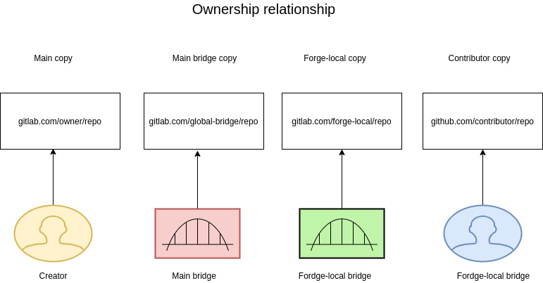

# Ecosystem Architecture

## Summary

Every bridge is consists of at least two components called interface,
each on either side of the bridge. State is synchronised with respect to
the global-owner repository and when state changes are made on
forge-local copies, each copy aims to be eventually consistent, i.e,
state is synchronised is whichever order they arrive at the bridge.

## Terminology

-   **Interface:** A bridge component that talks the bridge protocol and is
    able to affect changes to the forge that it manages.

-   **Creator:** A person or a team that is responsible for managing the
    project.

-   **Main copy:** creator's copy of the source code. In pre-federation
    forges, these are the main/upstream repositories.

-   **Main forge:** The forge on which the creator's repository is hosted

-   **Main Interface:** An interface that is hosted on the main forge or
    is able to perform actions that directly make changes to the main
    forge's contents. They usually have some authenticated access to the
    main forge(OAuth access, etc.) and also have a namespace on the
    forge where they can host forked repositories.

-   **Main-interface copy:** A forked copy the main copy. These is managed
    by the main interface and is used to pass on changes from other
    contributors to the main copy.

-   **Local Interface:** An interface that is operated on the
    contributor's forge. **local and main interface roles are
    interchangeable and are decided based on the direction of the
    transaction** They usually have some authenticated access to the
    local forge(OAuth access, etc.) and also have a namespace on it
    where they can host copies(manual cloning and uploading) of the main
    copy.

-   **Local-interface copy:** A manually cloned and uploaded version of the
    main copy. This exists on the contributor's forge and is managed by
    the local interface. Any pull request/patch submissions by the
    contributor is made against this copy.

-   **Contributor:** person who wishes to take part in the development of
    a project that is **not** on the `main forge`.

-   **Contributor-fork:** A contributor's fork of local interface copy.

## Architecture and mechanism

1. Contributor requests `local interface` to fork a repository not local to their forge

2. `Local interface` contacts North Star, federated forge protocol's
   discovery service, to find main interfaces for `main forge`. And
   requests a `main interface` to fork the `main copy`.

3. `Local interface` clones and uploads `main copy` to `local forge`

4. `Contributor` forks `local-interface copy` and makes changes.

5. `Contributor` sends patch/pull request to `local-interface copy`.

6. `Local interface` processes contributor's changes(apply
   `.forgeignore`, etc.) and generates a patch. This patch is sent to
   the `Main interface`.

7. `Main interface` applies the patch on `main-interface copy` and makes
   PR/sends patch to `main copy`.

9. Creator verifies the patch and applies it to `main copy`
